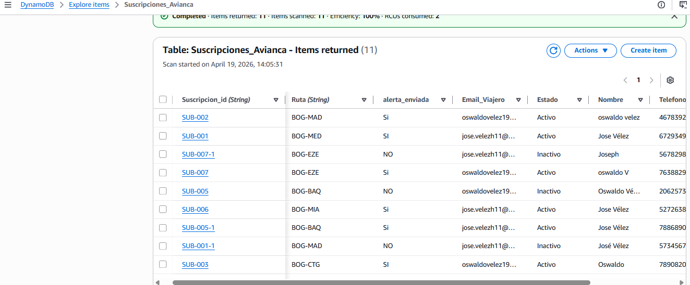

# ✈️ AWS Serverless Flight Price Alert System

> A serverless application built on AWS that monitors simulated flight prices and automatically notifies users by email when a lower fare is detected.


---
## 📖 Project Overview

This project implements a **serverless cloud solution** on **Amazon Web Services (AWS)** that monitors simulated flight prices and automatically notifies users by email when a lower fare is detected.

The application follows an **Event-Driven Architecture**, where Amazon EventBridge triggers AWS Lambda functions responsible for processing flight data, evaluating price changes, storing information in Amazon DynamoDB, and sending notifications through Amazon SNS and Amazon SES.

The solution was designed to demonstrate how AWS managed services can be integrated to build scalable, cost-effective, and fully serverless applications without managing traditional servers.

### Business Scenario

Many travelers miss airline promotions because checking ticket prices manually is time-consuming and inefficient.

This project simulates an automated monitoring service that continuously evaluates flight prices and immediately notifies subscribed users whenever a lower price is available.

---
# 🏗️ Solution Architecture

The application is built following a **serverless event-driven architecture** using fully managed AWS services.

Instead of relying on traditional servers, the system reacts automatically to scheduled events, processes flight information, stores data, and sends email notifications without requiring infrastructure management.

This architecture provides:

- High scalability
- Low operational cost
- Automatic execution
- Minimal infrastructure management
- Easy maintenance
- High availability

The following AWS services are integrated to build the complete solution:

| AWS Service | Purpose |
|------------|---------|
| Amazon EventBridge | Triggers scheduled events to start the monitoring process. |
| AWS Lambda | Executes the application logic and processes flight information. |
| Amazon DynamoDB | Stores user subscriptions and flight monitoring data. |
| Amazon SNS | Publishes notification events. |
| Amazon SES | Sends email alerts to subscribed users. |
| AWS IAM | Manages permissions and secure access between AWS services. |

## 📐 Architecture Diagram

> The complete architecture diagram will be added in the next section.

---

# 🚀 Key Features

- ✅ Fully serverless architecture built on Amazon Web Services (AWS).
- 📅 Automated execution using Amazon EventBridge scheduled rules.
- ⚡ Event-driven workflow with AWS Lambda.
- 🗄️ Flight and user information stored in Amazon DynamoDB.
- 📧 Automatic email notifications using Amazon SES.
- 📢 Event publishing through Amazon SNS.
- 🔐 Secure access management using AWS IAM roles and policies.
- 📈 Scalable solution without server management.
- 💰 Cost-efficient architecture based on AWS managed services.
- 🐍 Developed in Python using the AWS SDK (Boto3).

  ---

# 🛠️ Technologies Used

| Category | Technology |
|-----------|------------|
| Programming Language | Python 3 |
| Cloud Provider | Amazon Web Services (AWS) |
| Compute | AWS Lambda |
| Event Management | Amazon EventBridge |
| Database | Amazon DynamoDB |
| Messaging | Amazon Simple Notification Service (SNS) |
| Email Service | Amazon Simple Email Service (SES) |
| Identity & Security | AWS Identity and Access Management (IAM) |
| SDK | Boto3 |
| Architecture | Serverless, Event-Driven |

---

# 📂 Project Structure

```text
aws-serverless-flight-price-alert
│
├── README.md
├── LICENSE
├── requirements.txt
├── lambda_function.py
├── Documentacion_Tecnica.pdf
│
├── Evidencias/
│   ├── EventBridge Configuration
│   ├── Lambda Function
│   ├── DynamoDB Table
│   ├── SNS Topic
│   ├── SES Configuration
│   ├── Email Notification
│   └── AWS Console Screenshots
│
└── Additional Project Files
```
---

# ☁️ AWS Services Used

The project integrates multiple AWS managed services to build a fully serverless and event-driven solution.

## Amazon EventBridge

**Purpose**

Triggers the monitoring process automatically based on a scheduled rule.

**Why was it selected?**

Amazon EventBridge provides a reliable serverless scheduler that eliminates the need for cron jobs or dedicated servers.

---

## AWS Lambda

**Purpose**

Executes the business logic of the application, processes simulated flight prices, validates price changes, and coordinates communication between AWS services.

**Why was it selected?**

AWS Lambda allows code execution without provisioning or managing servers, automatically scaling according to demand.

---

## Amazon DynamoDB

**Purpose**

Stores user subscriptions and monitored flight information.

**Why was it selected?**

DynamoDB offers low-latency performance, automatic scaling, and seamless integration with serverless applications.

---

## Amazon SNS

**Purpose**

Publishes notification events generated by the application.

**Why was it selected?**

Amazon SNS simplifies message distribution and decouples communication between services.

---

## Amazon SES

**Purpose**

Sends email notifications to subscribed users when a lower flight price is detected.

**Why was it selected?**

Amazon SES is a scalable and cost-effective email service fully integrated with AWS.

---

## AWS IAM

**Purpose**

Controls permissions and secure communication between AWS services.

**Why was it selected?**

IAM follows the principle of least privilege, ensuring secure access to AWS resources.

---

# 🚀 Deployment Process

The application was deployed following a serverless architecture using AWS managed services.

## Deployment Steps

### 1️⃣ Configure IAM

Create IAM roles and policies with the minimum required permissions for AWS Lambda to access Amazon DynamoDB, Amazon SNS, Amazon SES, and Amazon EventBridge.

---

### 2️⃣ Create the DynamoDB Table

Create the DynamoDB table to store user subscription information and flight monitoring data.

---

### 3️⃣ Deploy the Lambda Function

Upload the Python source code to AWS Lambda and configure the execution role.

---

### 4️⃣ Configure Amazon EventBridge

Create a scheduled rule that automatically invokes the Lambda function at predefined intervals.

---

### 5️⃣ Configure Amazon SNS

Create an SNS topic to publish notification events generated by the application.

---

### 6️⃣ Configure Amazon SES

Verify sender and recipient email addresses and configure Amazon SES to send notification emails.

---

### 7️⃣ Test the Application

Execute the Lambda function manually to verify the complete workflow.

---

### 8️⃣ Automated Monitoring

After deployment, Amazon EventBridge automatically triggers the monitoring process according to the configured schedule.

---

# 📸 Project Evidence

The following screenshots document the deployment and validation of the solution in AWS.

## 🏗️ Solution Architecture


High-level architecture showing the interaction between Amazon EventBridge, AWS Lambda, Amazon DynamoDB, Amazon SNS and Amazon SES.

---

## 🔐 IAM Configuration


IAM roles and permissions configured following the principle of least privilege, allowing secure communication between AWS services.

---

## 🗄️ Amazon DynamoDB



DynamoDB stores user subscriptions and simulated flight monitoring data.

---

## ⚡ AWS Lambda


AWS Lambda contains the business logic responsible for processing flight prices and coordinating the serverless workflow.

---

## ⏰ Amazon EventBridge


Amazon EventBridge automatically triggers the Lambda function according to the configured schedule.

---

## 📧 Amazon SES


Amazon SES is configured to send email notifications when a lower flight price is detected.

---

## 📢 Amazon SNS


Amazon SNS publishes notification events before the email is delivered through Amazon SES.

---

## 💰 Cost Estimation


AWS Cost Explorer was used to estimate the monthly operational cost of the solution, demonstrating the cost efficiency of a serverless architecture.

---

## 📁 Additional Deployment Evidence

The repository also includes more than **30 deployment screenshots** documenting each configuration step performed during the implementation of the project.

👉 **[Ver todas las evidencias técnicas (30 capturas)](./Evidencias/)**

---

## 🛠️ Tecnologías Utilizadas
- **Lenguaje:** Python 3.x
- **Servicios Cloud:** AWS Lambda, DynamoDB, SES, SNS, EventBridge.
- **Seguridad:** IAM Roles con políticas de mínimo privilegio.

- [📄 Descargar Documentación completa en pdf](./Documentacion_Tecnica_Avianca.pdf)

---
*© 2026 Oswaldo Velez - cloud architect*
